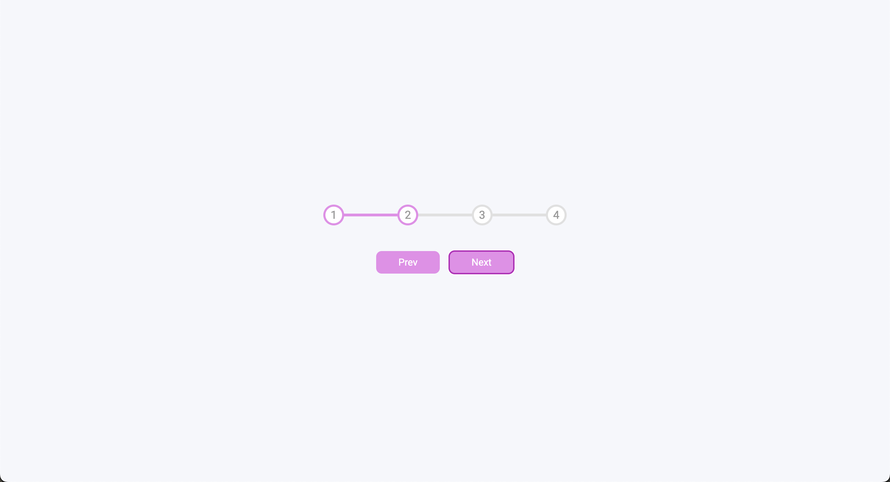

# Progress Steps

This is project 2 of 50 for Brad Traversy's course [50 Projects in 50 Days](https://50projects50days.com/). I used HTML, CSS and JavaScript to build a dynamic multi-step progress bar. The button was styled with accessibility in mind, showing a contrasting outline for users who navigate with a keyboard. I'm open to feedback and any suggestions!

## Screenshot and Live Demo

[Click here to view the live demo](https://sianidan.github.io/Progress-Steps/)
